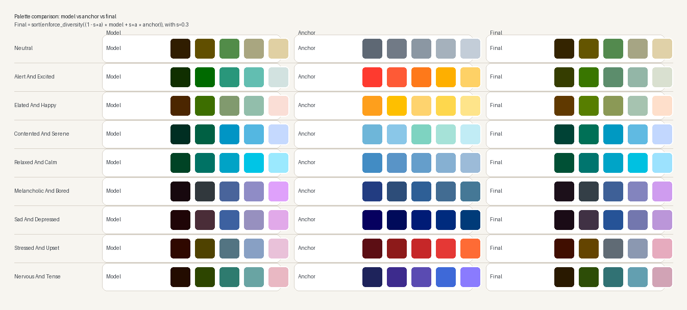
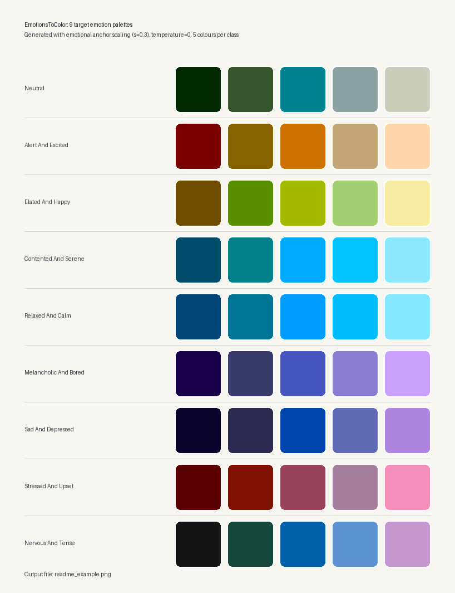

# EmotionsToColor

A lightweight neural model that generates 5-colour palettes from natural language descriptions, grounded in the perceptual **Oklab** colour space and evaluated against Russell's circumplex model of affect.

Built as part of a Master's thesis in Acoustic Engineering at Politecnico di Milano.

---

## Scope

This project is part of my Master's thesis in Acoustic Engineering at Politecnico di Milano.

The goal is to generate a VR environment driven by a **Music Emotion Recognition (MER)** model 
that analyses piano performances using audio signals, motion tracking, and EMG data.
The MER model classifies performances into 9 emotional states based on Russell's 
circumplex model of affect:

| Class | Description |
|---|---|
| Neutral | Emotional balance, absence of strong feelings |
| Alert and excited | Heightened awareness, anticipation, energized |
| Elated and happy | Intense joy and satisfaction, sense of fulfillment |
| Contented and serene | Peaceful well-being, no immediate desires |
| Relaxed and calm | Physical and mental ease, free from tension |
| Melancholic and bored | Reflective sadness, lack of stimulation |
| Sad and depressed | Deep unhappiness or despair |
| Stressed and upset | Mental strain, frustration or discomfort |
| Nervous and tense | Apprehension and unease, physical tension |

The first stage of environment generation is **colour palette assignment**.
This model generates perceptually coherent 5-colour palettes from emotion class labels
and streams them to Unity via the **OSC protocol**.

**Why Oklab?**  
Oklab is a perceptually uniform colour space — equal numerical distances correspond to 
equal perceived colour differences. This guarantees smooth, artefact-free transitions 
between emotional scenes and consistent rendering across devices.

---

## How it works

```
Text prompt
    │
    ├─ plain CLIP encoding ──────────────────────────────┐
    └─ + colour descriptor → enriched CLIP encoding ─── interpolate (w=0.25) → re-normalise
    │
    ▼
CLIP ViT-B/32 (OpenAI)   →  512-dim embedding
    │
    ▼
Text2PaletteModel         →  5 × Oklab (L, a, b)
    │
    ▼
Emotional anchor blend    →  circumplex-aligned palette
    │
    ▼
enforce_diversity          →  spread colours apart
    │
    ▼
sort_palette_by_luminance  →  darkest → lightest (Unity-ready)
    │
    ▼
oklab_to_hex               →  final palette (#rrggbb × 5)
```

The model is trained on ~35 000 colour palettes paired with text descriptions (LLM-generated) and tag-based annotations. Tag-based samples receive 4× sample weight during training.

---

## Model & Training

### Architecture

Text2Palette uses a **two-stage architecture**:

1. **CLIP ViT-B/32** (frozen) — encodes the text prompt into a 512-dimensional embedding.
   CLIP was chosen over alternatives (e.g. Sentence-BERT) because it was trained on
   image-text pairs, giving it a strong prior on the visual semantics of colour-related
   language (*"warm sunset"*, *"cold winter"*, *"neon night"*).

2. **Text2PaletteModel** — a lightweight MLP that maps the CLIP embedding to 5 colours
   in Oklab space. The architecture consists of:
   - A shared encoder (2 × Linear → GELU → LayerNorm → Dropout 0.1)
   - Five independent colour heads (one per output colour), each predicting (L, a, b)

   Output activations enforce valid Oklab ranges:
   - L ∈ [0, 1] via **Sigmoid**
   - a, b ∈ [−0.5, 0.5] via **Tanh × 0.5**

The model has ~800K parameters and runs in < 5ms per inference on CPU.

---

### Training

The model is trained end-to-end with a **composite loss** of three terms:

```
L = L_huber + 0.3 · L_triplet + 1.0 · L_diversity + 0.5 · L_spread
```

| Term | Role |
|---|---|
| **Huber** | Reconstruction — predicted palette close to ground truth |
| **Triplet** | Ranking — palette of prompt A closer to its target than to prompt B's target |
| **Diversity penalty** | Prevents colour collapse — pushes colours apart if closer than 0.12 |
| **Lightness spread** | Forces L values to span [0.1, 0.9] evenly across the 5 colours |

**Why Huber instead of MSE?**  
Huber is less sensitive to outliers in colour space — some training palettes contain
very dark or very saturated colours that would dominate a squared loss.

**Why Triplet loss?**  
It teaches the model *relative* semantics: the palette for *"happy"* should be closer
to other happy palettes than to sad ones. This improves generalisation to unseen prompts
without requiring explicit emotion labels during training.

**Sample weighting:** tag-based palettes (ColorHunt) receive 4× weight relative to
LLM-described palettes (ColorHex), reflecting higher confidence in their semantic labels.

Training runs for 200 epochs with AdamW (lr=3e-4, cosine annealing to 1e-5)
on ~28 000 training samples. On Apple M1 Max: ~24s/epoch.

---

### Emotional Anchor Blend

The model is trained on generic colour-text pairs and has no explicit emotion supervision.
To align output palettes with the 9 target emotion classes, a **post-hoc anchor blend**
is applied at inference time:

```
palette_final = (1 − s·α) · palette_model + s·α · anchor_class
```
Anchor palettes are hand-crafted Oklab targets grounded in colour psychology and
Russell's circumplex model of affect. The blend weight α is tuned per class (0.25–0.60),
and a global scale factor **s = 0.3** is applied to all weights, giving effective blend
strengths in the range **0.075–0.18**. This keeps the pipeline predominantly model-based
while nudging palettes toward the intended affective region instead of replacing the
model output with anchor-dominated colours. Re-run `evaluate.py` for current metrics.

The current anchor set was revised to better match the intended colour semantics:

| Class | Anchor direction |
|---|---|
| Neutral | cooler blue-gray neutrals instead of warm greige |
| Alert and excited | cleaner orange-red-yellow high-energy hues |
| Elated and happy | brighter yellow / golden tones, less amber-heavy |
| Contented and serene | aqua / sky / seafoam tones instead of warm beige |
| Stressed and upset | red-led palette with stronger urgency cues |
| Nervous and tense | colder violet-blue tension cues with more contrast |

These anchor revisions improve semantic alignment, but the side-by-side comparison
still shows a warm bias in the raw model output for several classes. That bias is only
partially corrected by the current blend strengths, because raising α further would
make the output anchor-dominated rather than model-generated.

### Prompt Colour Enrichment

To further close the gap between the model's generic colour prior and the intended
affective zone, the inference pipeline applies a **colour-hint interpolation** at the
embedding level before the model forward pass:

```python
# colour_enrichment_weight = 0.25 (default)
emb = (1 - w) * emb_plain + w * emb_enriched
emb = emb / emb.norm(dim=-1, keepdim=True)
```

For each emotion class a short natural-language colour descriptor is appended to the
prompt and encoded separately by CLIP. The two normalised embeddings are then
interpolated at weight `w = 0.25` — giving 75% of the signal to the original semantic
prompt and 25% to the colour hint — and the result is re-normalised before being fed
to the palette model.

This technique compensates for the fact that the model was not trained with emotion
labels and therefore has no intrinsic concept of which colours map to which affective
states. The colour hint steers the CLIP embedding toward the correct chromatic zone,
but because the model itself has not learned emotion-to-colour associations, the hint
also reduces embedding variance and therefore palette diversity. The improvements in
discrimination metrics are largely attributable to this steering, not to the model's
learned representations.

The weight `w` is configurable per call (`color_enrichment_weight` argument to
`generate()`). For free-form prompts that do not match any emotion class the enriched
embedding is not used (`w` effectively becomes `0`), so behaviour for open-ended prompts
is unchanged from the baseline.

---

### Palette Ordering

After diversity enforcement the 5 colours are sorted by Oklab **L** (lightness) in
ascending order — darkest to lightest:

| Index | Role (Unity convention) |
|-------|------------------------|
| 0 | Darkest — shadows, backgrounds |
| 1 | Dark mid-tone |
| 2 | Mid-tone |
| 3 | Light mid-tone |
| 4 | Lightest — highlights, foreground accents |

This deterministic ordering lets Unity shaders and scripts address palette slots by
perceived brightness without needing to sort at runtime.

### Inference Temperature

The inference pipeline adds Gaussian noise to the CLIP embedding before each forward
pass so that repeated calls with the same prompt return perceptibly different palettes:

```python
T_SCALED = 0.25 / (EMBED_DIM ** 0.5)   # ≈ 0.011  →  ~14° angular deviation
emb = emb + torch.randn_like(emb) * T_SCALED
emb = emb / emb.norm(dim=-1, keepdim=True)
```

Pass `temperature=0.0` to `generate()` to get a deterministic output (used internally
by `evaluate.py`).

---

## Results

Evaluated on 9 emotion classes from Russell's circumplex model of affect.
Full pipeline: colour-hint embedding interpolation (`w = 0.25`) → CLIP ViT-B/32 → Text2PaletteModel → emotional anchor blend → enforce_diversity → sort_palette_by_luminance.

Current metrics below were obtained with **emotional anchor scaling** enabled
(`s = 0.3`) and **prompt colour enrichment** (`w = 0.25`), using `N = 10` stochastic
samples for the intra-class consistency check and deterministic inference
(`temperature = 0`) for inter-class, circumplex, and diversity evaluation.

| Metric | Raw model | After anchor | Target |
|---|---|---|---|
| Intra-class Consistency | 0.0117 | unchanged | < 0.08 |
| Inter-class Discrimination | 0.2257 | 0.2294 | > 0.15 |
| Circumplex Pearson r | 0.5913 | **0.6417** | > 0.50 |
| Intra-palette Diversity | 0.3371 | 0.2930 | > 0.18 |
| Mean Anchor Gap to Theoretical Anchor | 0.2833 | 0.2459 | lower is better |

> **Note — consistency metric uses `T = 0.05 / √512 ≈ 0.0022`** (evaluation temperature).
> Interactive inference uses the higher default `T = 0.25 / √512 ≈ 0.011`, which gives
> perceptibly different palettes across runs (~14° angular deviation on the embedding sphere).

All numeric targets are met, but the interpretation requires care:

- **Discrimination** rises from `0.1495` (without enrichment) to `0.2257` with colour-enriched prompts. This improvement comes from steering the CLIP embedding *before* model inference, not from the palette model learning emotion-to-colour associations.
- **Circumplex r = 0.6417** indicates a moderate positive correlation between palette distances and Russell circumplex distances — classes that are far apart emotionally tend to produce more distinct palettes, but the relationship is not strong. Pairs such as `neutral ↔ nervous and tense` (`0.0633`) and `sad ↔ nervous` (`0.0657`) remain poorly separated despite being semantically distant.
- **Consistency (0.0117)** is partly a consequence of the enrichment reducing embedding variance, not only model quality per se.
- **Mean anchor gap (0.2459)** remains substantial after blending. This reflects the inherent limitation of a low-weight post-processing step: at effective blend strengths of 0.075–0.18 the palette cannot deviate far from the raw model output.
- **Diversity** drops from `0.3371` to `0.2930` after anchor blending, as expected — blending five colours toward a common anchor reduces their spread.

The closest inter-class pairs after blending are `contented and serene ↔ relaxed and calm`
(`0.0453`), `neutral ↔ nervous and tense` (`0.0633`), `sad and depressed ↔ nervous and tense`
(`0.0657`), and `melancholic and bored ↔ sad and depressed` (`0.0858`). The first and last
pairs are semantically adjacent in the circumplex, so low palette distance is expected.
The middle two are semantically distant and represent the main unresolved ambiguities.

The comparison between raw model output, theoretical anchors, and final blended palettes
can be regenerated locally with `python generate_anchor_comparison.py`.


  
---

## Limitations

The palette model was trained on generic colour-text pairs with no explicit emotion
supervision. The training objective — reconstructing palettes from their text descriptions
— does not teach the model which emotional states correspond to which chromatic regions.
As a result, the raw model output has a warm/olive bias across several emotion classes
(neutral, alert, stressed, nervous), and both the anchor blend and the prompt enrichment
are compensating corrections rather than properties learned by the model.

Key limitations of the current approach:

- **No end-to-end emotion learning.** The model cannot generalise to free-form prompts that
  express emotion indirectly (e.g. *"a panic attack"*, *"bitter resignation"*). Anchor
  matching relies on word overlap; mismatched or unrecognised prompts receive no chromatic
  correction.
- **Anchor blend has limited correction power.** Effective blend strengths of 0.075–0.18
  are insufficient to fully override the raw model's warm bias. Higher values would produce
  anchor-dominated palettes indistinguishable from the hand-crafted targets.
- **Metric improvements are partially artefactual.** The discrimination improvement from
  `0.1495` to `0.2257` is driven by the colour-hint embedding interpolation, which directly
  encodes chromatic information into the CLIP input — not by the model's internal
  representations.
- **Nearest-pair ambiguities persist.** `neutral ↔ nervous and tense` remain perceptually
  close (`0.0633`) despite being semantically distant in the Russell circumplex. This is a
  structural failure that post-hoc corrections cannot fully resolve.

The most direct path to higher quality would be fine-tuning with explicit emotion supervision
— for example, a triplet loss that pulls palettes of the same emotion class together and
pushes palettes of distant classes apart — or training on a purpose-built emotion-annotated
colour dataset.
  
---

  The following image is an example generated on the 9 emotional classes taken into consideration.
  It can be regenerated locally with `python generate_readme_example.py`.
  


---

## Quickstart

```bash
# 1 — Install dependencies
pip install -r requirements.txt

# 2 — Download the pretrained model
# → Get best_palette_gen.pt from the GitHub Releases page
# → Place it in data/best_palette_gen.pt

# 3 — Run inference
python inference.py
```

To retrain from scratch:
```bash
# Regenerate processed splits (optional, already included)
python merge_datasets.py

# Train (200 epochs, ~24s/epoch on Apple M1 Max)
python train.py

# Evaluate
python evaluate.py
```

---

## Datasets

The processed CSVs are derived from two public colour palette sources and preprocessed into Oklab (L, a, b) coordinates using the `colour-science` library. Raw sources are included in `data/raw/` for full reproducibility.

Embeddings (`.npy`) are not included — they are computed automatically on first run and cached locally.

---

## Requirements

- Python ≥ 3.10
- PyTorch ≥ 2.0
- Apple MPS, CUDA, or CPU

See `requirements.txt` for the full list.

---

## References & Credits

**Colour space**
- Björn Ottosson — [Oklab perceptual colour space](https://bottosson.github.io/posts/oklab/)
- [`colour-science`](https://www.colour-science.org/) — Oklab conversion library

**Embeddings**
- OpenAI / LAION — [CLIP ViT-B/32](https://github.com/mlfoundations/open_clip)

**Emotion model**
- Russell, J. A. (1980). *A circumplex model of affect*. Journal of Personality and 
  Social Psychology, 39(6), 1161–1178.

**Datasets**
- Colour palette data sourced from public online repositories,
  preprocessed into Oklab coordinates and paired with text annotations.

  **Related work**
- Bahng et al. (2018). *Coloring with Words: Guiding Image Colorization 
  Through Text-based Palette Generation.*
  [Text2Colors](https://github.com/awesome-davian/Text2Colors) — ECCV 2018.

## License

Code: MIT  
Dataset: [CC BY 4.0](https://creativecommons.org/licenses/by/4.0/)
